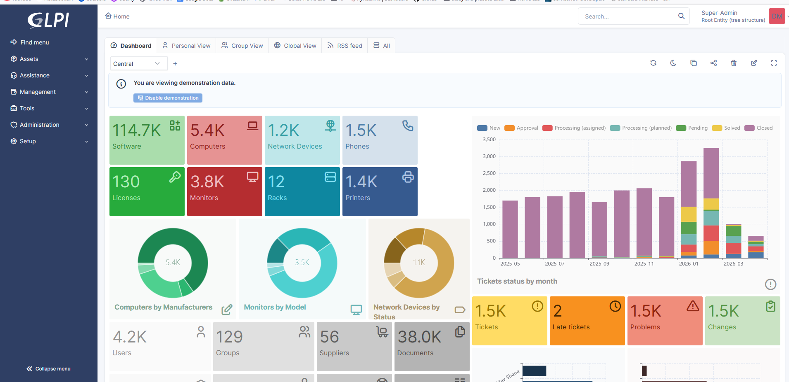
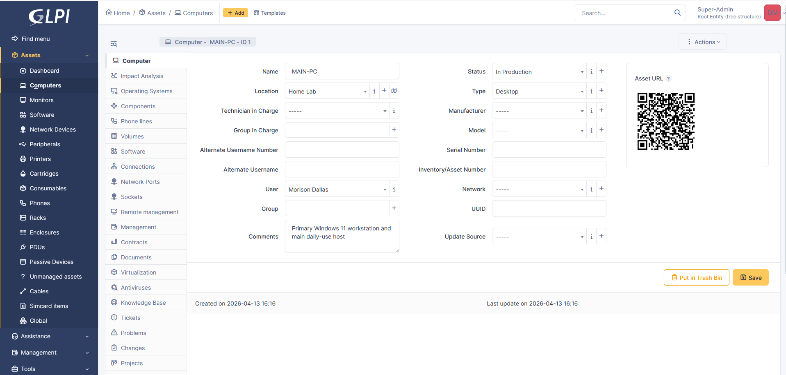
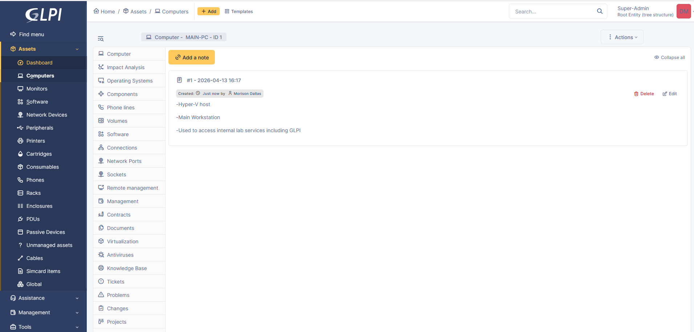
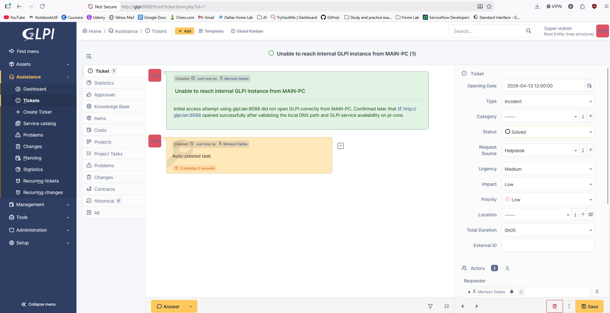
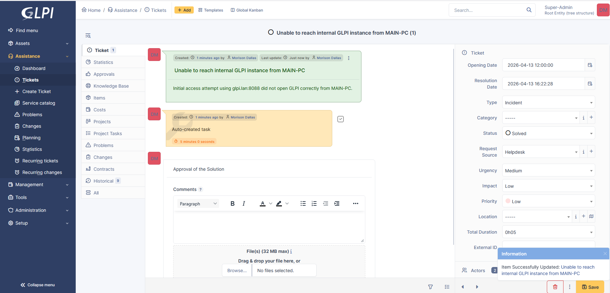
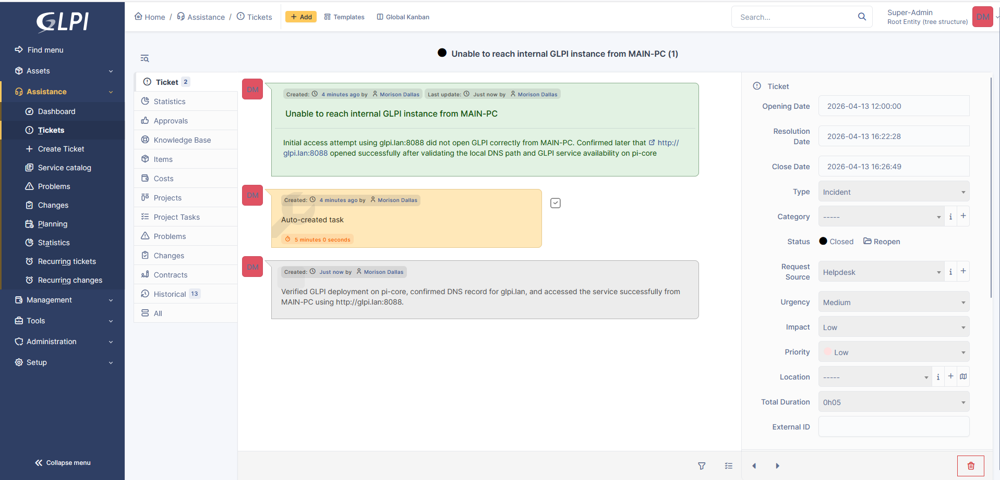
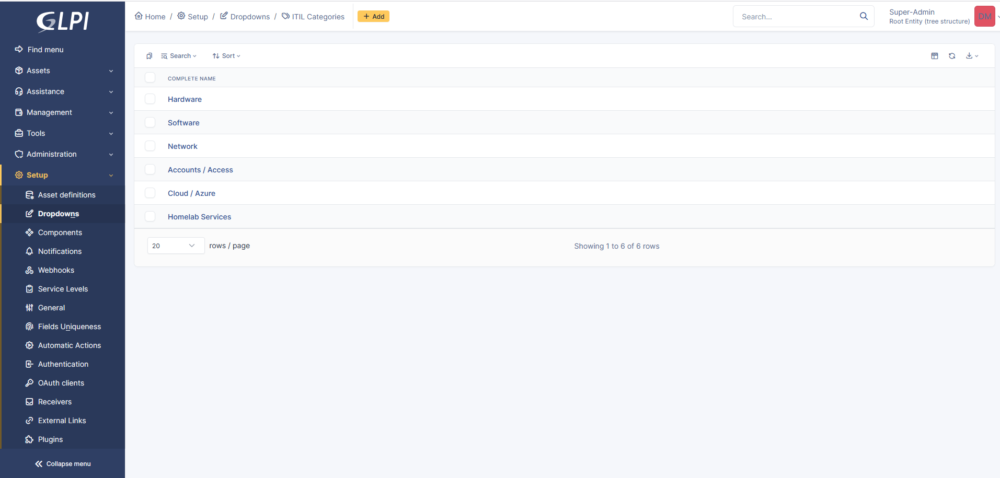

# GLPI Internal ITSM Lab on Pi-Core

## Objective

Deploy GLPI as an internal-only ITSM platform in the homelab, make it reachable from `MAIN-PC`, complete the initial admin setup, create the first assets and tickets, add an internal service-catalog baseline, and add local plus off-host backup validation.

## Environment

- Platform: self-hosted homelab
- Workstation used for validation: `MAIN-PC`
- GLPI host: `pi-core`
- Evidence source: local screenshots and deployment notes captured on `2026-04-13`

## Technologies Used

- GLPI
- Docker / `docker-compose`
- MariaDB
- Pi-hole local DNS
- Debian 12
- Cron-based backups and off-host validation

## Resource Details

- Live URL: `http://glpi.lan:8088`
- Host: `pi-core`
- Deployment root: `/srv/glpi`
- Main stack components:
  - `glpi-app`
  - `glpi-db`
- Internal DNS record:
  - `glpi.lan -> 192.168.1.224`

## Lab Relationship

This lab extends the homelab operations work rather than standing alone. GLPI was intentionally placed on `pi-core` instead of `asus-server` to avoid adding more RAM pressure to the main container host, while still keeping the service internal to the lab.

## Hiring Manager Quick View

| Review area | Evidence |
|---|---|
| ITSM workflow | GLPI deployed, admin setup completed, assets created, first ticket created/updated/closed |
| Help desk operations | ITIL categories and pinned service-catalog entries for internal services |
| Infrastructure support | Docker/MariaDB stack, internal DNS, workstation reachability validation |
| Backup discipline | Nightly local backup plus off-host pull/validation workflow |
| Documentation quality | Screenshot evidence plus text-based service-catalog validation |

## Steps Performed

1. Compared current host capacity and chose `pi-core` for the GLPI deployment.
2. Built a Docker-based GLPI stack with a dedicated MariaDB backend.
3. Published GLPI internally on TCP `8088` because `pi-core` was already using port `80` for Pi-hole.
4. Added `glpi.lan` to internal DNS and confirmed access from `MAIN-PC`.
5. Completed the GLPI web installer.
6. Logged in with the default admin account and changed the password immediately.
7. Set the admin profile name, email, and timezone.
8. Enabled GLPI timezone support in the deployed container environment.
9. Created the first assets:
   - `MAIN-PC`
   - `pi-core`
   - `asus-server`
10. Added notes to the `MAIN-PC` asset record to capture workstation role and lab context.
11. Created an incident ticket documenting the initial GLPI reachability issue and its resolution.
12. Created top-level ITIL categories for future ticket organization.
13. Created the initial GLPI service-catalog baseline:
   - `GLPI`
   - `Pi-hole DNS`
   - `Homepage`
   - `Uptime Kuma`
   - `Immich`
   - `Portainer`
   - pinned in the helpdesk/service catalog
   - mapped to `Homelab Services`
14. Configured nightly local backups for the GLPI database and persistent files on `pi-core`.
15. Added a MacMint pull job that copies the latest GLPI backup off `pi-core`, verifies the SQL dump, validates the files archive, and checks SHA256 hashes.

## Validation

- GLPI became reachable from `MAIN-PC` at `http://glpi.lan:8088`.
- Login worked after installation and the admin password was changed.
- Asset records were created successfully for the main workstation and two core lab systems.
- The first ticket was created, updated, and closed inside GLPI.
- ITIL categories were created for `Hardware`, `Software`, `Network`, `Accounts / Access`, `Cloud / Azure`, and `Homelab Services`.
- Pinned service-catalog entries were created for GLPI and key internal services.
- Backup automation was configured on the host after a successful manual test.
- Off-host backup validation passed for the latest GLPI backup set copied to MacMint.
- The service-catalog baseline was validated from live GLPI database state; see [SERVICE_CATALOG_EVIDENCE.md](SERVICE_CATALOG_EVIDENCE.md).

## Why This Matters

- It shows a support-oriented workflow instead of just a container deployment.
- It ties together service rollout, DNS validation, asset tracking, ticket handling, and backups in one usable internal system.
- It demonstrates that the homelab is being used to build operational habits, not just to host services.

## Screenshots

The evidence set for this repo is intentionally curated. A short note on the source screenshots is included in [EVIDENCE_NOTES.md](EVIDENCE_NOTES.md).

The service-catalog entries are documented separately in [SERVICE_CATALOG_EVIDENCE.md](SERVICE_CATALOG_EVIDENCE.md) because that evidence is cleaner as text than as a browser screenshot.

*Initial GLPI dashboard after the web installer completed and the admin account was usable.*

*Created the `MAIN-PC` asset record with production status and basic workstation details.*

*Added notes to the `MAIN-PC` asset to document its role as the main workstation and lab access point.*

*Created the first incident ticket to document the initial GLPI reachability issue from `MAIN-PC`.*

*Updated the ticket workflow while documenting validation and resolution progress.*

*Closed the incident ticket after confirming GLPI access from `MAIN-PC` through `glpi.lan:8088`.*

*Created the first top-level ITIL categories for future ticket classification.*

## What I Learned

- Internal DNS and service publishing matter just as much as the application install itself.
- A lightweight ITSM platform becomes useful quickly once assets, categories, and tickets are created immediately after deployment.
- Keeping a new service internal-only is the right default for a homelab system that is still being validated.
- Backup automation should be treated as part of the deployment, not as an optional cleanup task.

## Problems Encountered / Notes

- The original screenshot source folder also contained unrelated ServiceNow screenshots, so only the GLPI-specific images were copied into this repo.
- The evidence set starts after deployment and installer completion, so the container build and DNS work are documented from session notes rather than from browser screenshots.
- GLPI was intentionally left on `http://glpi.lan:8088` instead of moving behind a cleaner reverse proxy immediately, because `pi-core` already had Pi-hole bound to port `80`.
- Cleaner proxying and browser-based catalog screenshots are future scope. The current repo already documents the working catalog state through sanitized text evidence.

## Cost Control and Cleanup

- The service was deployed on existing homelab hardware instead of new cloud resources.
- `pi-core` was chosen specifically to avoid unnecessary memory pressure on `asus-server`.
- The stack remains internal-only and minimal:
  - GLPI app
  - MariaDB
  - local DNS entry
  - nightly backup job

## Repo Structure

- `README.md`
  - full walkthrough and evidence
- `LAB_SUMMARY.md`
  - short portfolio summary
- `EVIDENCE_NOTES.md`
  - evidence scope and screenshot-handling notes
- `SERVICE_CATALOG_EVIDENCE.md`
  - sanitized live-state evidence for the GLPI service-catalog baseline
- `images/`
  - curated GLPI screenshots used in this repo

## Outcome

This lab produced a working internal GLPI deployment on `pi-core`, validated access from `MAIN-PC`, created an initial asset and ticket structure, added a small internal service catalog, and added operational safety through nightly local backups plus off-host backup validation.
